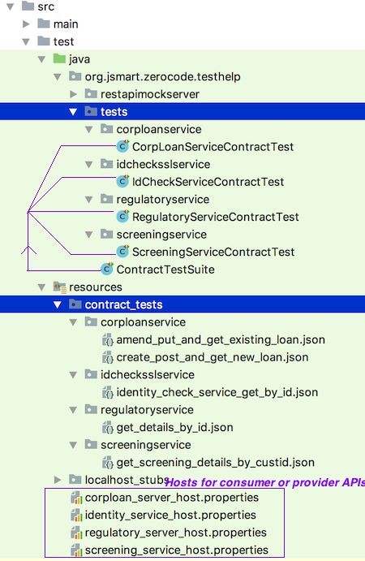

# consumer-contract-tests
Sample Consumer Contract Tests - Corp Bank



+ To build the project use maven command below:
```
mvn clean install -DskipTests
```

+ To run all the contract tests, run the `TestSuite`:
```java
org.jsmart.zerocode.testhelp.tests.ContractTestSuite
```

+ To run any particular contract test, run one of :
```java
org...tests.corploanservice.CorpLoanServiceContractTest

org...tests.idchecksslservice.IdCheckServiceContractTest

org...tests.regulatoryservice.RegulatoryServiceContractTest

org...tests.screeningservice.ScreeningServiceContractTest
```
That's it. Done.
===

_See also:_
===

+ See also how the contract tests are written without any hardcoded value, the test-steps has been chained from earlier `request/response`:
```java
@TargetEnv("corploan_server_host.properties")
@UseHttpClient(SslTrustHttpClient.class)
@RunWith(ZeroCodeUnitRunner.class)
public class CorpLoanServiceContractTest {

    @Test
    @JsonTestCase("contract_tests/corploanservice/create_post_and_get_new_loan.json")
    public void testNewLoan_crudOperations() throws Exception {

    }

}

```
 and the test-step:
```javaScript
...
        {
            "name": "get_loan_details_without_hard_coding",
            "url": "/api/v1/corp-loan/ids/${$.create_approved_loan.response.body.id}",
            "operation": "GET",
            "request": {
            },
            "assertions": {
                "status": 200,
                "body":{
                    "id" : "${$.create_approved_loan.response.body.id}",
                    "currency": "${$.create_approved_loan.request.body.currency}",
                    "dateSanctioned":"${$.create_approved_loan.request.body.dateSanctioned}",
                    "amountApplied": "$EQ.${$.create_approved_loan.request.body.amountApplied}",
                    "amountSanctioned": "$EQ.${$.create_approved_loan.request.body.amountSanctioned}"
                }
            }
        }

```

+ corploan_server_host.properties contains your target server details:
```properties
# Web Server host and port
restful.application.endpoint.host=http://localhost
restful.application.endpoint.port=8088

# Web Service context; Leave it blank in case you do not have a common context
restful.application.endpoint.context=

```

+ How to trigger the tests in CI build ?
Set up sure-fire plugin as below:

```xml
			<plugin>
				<groupId>org.apache.maven.plugins</groupId>
				<artifactId>maven-surefire-plugin</artifactId>
				<version>2.19.1</version>
				<configuration>
					<includes>
						<include>org.jsmart.zerocode.testhelp.tests.ContractTestSuite.class</include>
					</includes>
				</configuration>
			</plugin>
```
This will trigger the suite test i.e. `ContractTestSuite.java` which in turn will run all the tests.

+ ContractTestSuite is configured like below:
```java
@Suite.SuiteClasses({
        RegulatoryServiceContractTest.class,
        IdCheckServiceContractTest.class,
        CorpLoanServiceContractTest.class,
        ScreeningServiceContractTest.class
})
@RunWith(Suite.class)
public class ContractTestSuite {

}
```

+ Tu run locally:
  + Please make sure you have started the `RunMeFirstMockApiServer.java`
  + To run 
  ```
  mvn clean install   -or    mvn clean test
  ```
